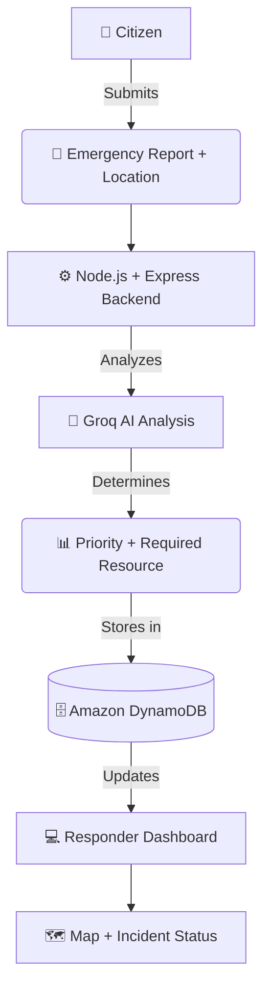
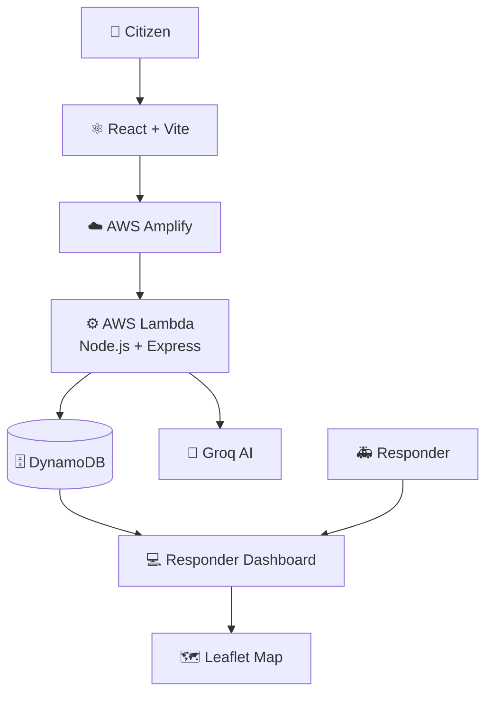

# 🌊 ResQNet

🌐 Live Demo: https://main.dxseivhko5r62.amplifyapp.com

💻 GitHub Repo: https://github.com/satyam-2x/ResQNet.git

## Description
AI-Powered Flood Emergency Coordination System
ResQNet is an AI-powered flood emergency coordination platform that helps citizens report emergencies and enables responders to monitor, prioritize, and manage incidents from a centralized dashboard.

The system combines AI analysis, location tracking, cloud storage, and an interactive incident map to organize flood emergency information.

---

## 🚨 Problem
During floods, emergency information can become scattered across calls, messages, and other communication channels.
Responders need to quickly know:

Where the emergency is happening
How serious it is
What resource is required
Whether the incident has been handled
ResQNet provides a centralized workflow for collecting and organizing this information.

---

## 💡 Solution Architecture

A citizen submits an emergency description along with their current location, triggering the following automated workflow:




## ✨ Key Features

### 👤 Citizen
Submit flood emergency reports
Provide name and phone number
Describe the emergency
Share current location using browser geolocation

---

### 🚑 Responder
View emergency incidents
Check priority and required resources
View incidents on an interactive map
View report count and incident details
Update status from Pending to Dispatched

---

### 🤖 AI Analysis

Groq AI analyzes the emergency description and identifies the following JSON payload:

```json
{
  "priority": "Critical",
  "resourceNeeded": "Lifeboat"
}

```

## 🏗️ Architecture




## 🛠️ Tech Stack

### Frontend
- React
- Tailwind CSS
- React Leaflet

### Backend
- Node.js
- Express.js
- Serverless HTTP

### AI
- Groq API

### Database & Storage
- AWS DynamoDB

### Deployment
- AWS Amplify
- AWS Lambda
- AWS IAM
- Amazon CloudWatch

### ☁️ AWS Usage
- AWS Amplify

- Hosts the React frontend and provides GitHub-based deployment.

- AWS Lambda

- Runs the Node.js/Express backend using a serverless architecture.

- Amazon DynamoDB

- Stores citizen reports and emergency incidents.

- AWS IAM

- Provides the Lambda execution role with required AWS permissions.

- Amazon CloudWatch

- Used for Lambda logs and debugging.

### 🔄 Incident Workflow

Emergency Report
      ↓
AI Analysis
      ↓
Incident Created
      ↓
Pending
      ↓
Responder Reviews
      ↓
Resource Dispatched
      ↓
Dispatched


## 📁 Project Structure

```text
ResQNet/
├── frontend/                # React + Vite application
│   └── src/
│       ├── components/      # Reusable UI components
│       ├── pages/           # Citizen and Responder views
│       ├── services/        # API calls (Axios/Fetch)
│       └── assets/          # Static files, images, and icons
│
└── backend/                 # Node.js + Express API
    ├── config/              # Database and environment configs
    ├── controllers/         # Request handling logic
    ├── middlewares/         # Custom Express middlewares
    ├── models/              # DynamoDB data schemas
    ├── routes/              # API endpoints definitions
    ├── services/            # Groq AI integration & core logic
    ├── lambda.js            # AWS Lambda entry point
    ├── server.js            # Local development server
    └── package.json         # Backend dependencies
```


## Local Setup

```bash
Clone
git clone https://github.com/satyam-2x/ResQNet.git
cd ResQNet
Frontend
cd frontend
npm install
npm run dev

Create .env.development:

VITE_API_URL=http://localhost:5000/api/v1
Backend
cd backend
npm install
npm start

Create .env:

GROQ_API_KEY=your_groq_api_key

Never commit API keys or other secrets to GitHub.
```

## 🌐 Deployment

- Component	Service
- Frontend	AWS Amplify
- Backend	AWS Lambda
- Database	Amazon DynamoDB
- Logs	Amazon CloudWatch
- Permissions	AWS IAM

## 🔮 Future Improvements

- Real-time incident updates
- Emergency notifications
- Responder authentication
- Duplicate incident detection
- Advanced incident grouping
- Emergency heatmaps
- Resource availability tracking
- Automated resource assignment

## 🏆 Hackathon

> **Built for WeMakeDevs × AWS Bharat Builds Tour — First Commit** 🚀

**ResQNet** demonstrates how **AI** and **AWS Cloud Services** can be combined to build a practical, real-time flood emergency coordination system.